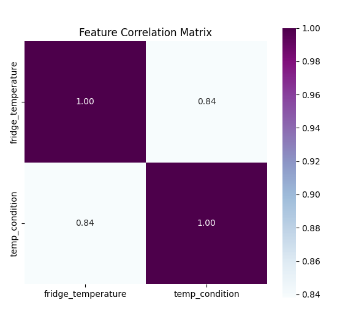
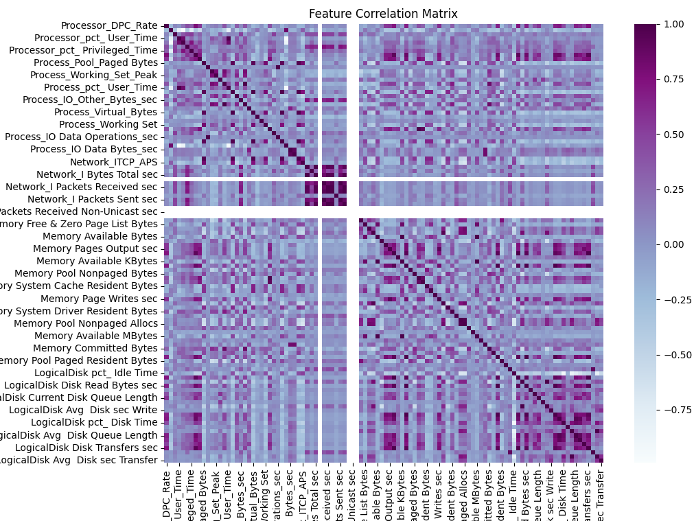
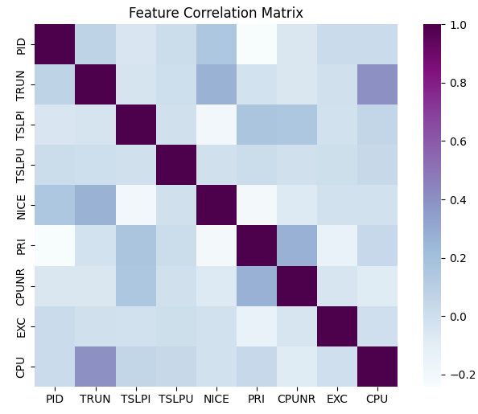

# ML / Dataset research

This repo contains some sample code for testing and comparing datasets and ML algorithms.

The following README.md is a top-down summary of progress.

## Install
To use this reserach code:
```bash
git pull https://github.com/Bierchermuesli/sklearn-research
cd sklearn-research
pipenv shell 
pipenv install
```


## RT-IoT2022 Dataset research

<details>
<summary>A summary of inital setup and RT-IoT research.... </summary>


I decided to work with scikit-learn and adopted some model samples  [from here](https://www.kaggle.com/code/navyeesh/kothoju-navyeesh-rt-iot2022) ([Apache 2.0 ](https://www.apache.org/licenses/LICENSE-2.0)) I added some of my  enhancements:

 * add a OneHotEncoder for better handling with missing(?), categorical or numerical features
 * Included a binary label to differentiate between Normal and Attack traffic pattern
 * Created a dedicated encoder and preprocessor pipeline for reuse in prediction tasks
 * Implemented model saving functionality with joblib
 * Organized the code for better clarity and to accommodate additional models
 * Added some command-line arguments
 * data normalization
 * per dataset options
 * a fancy spinner!
 
 currently basic models are in use. 

In the current sample, the following models are generated:
 * Linear Perceptron
 * RandomForest
 * A VotingClassifier combining Random Forest, Decision Tree, KNN, and MLP Classifier


This is a ML training Proof of concept with RT-IoT2022 Dataset. This dataset is licensed under [CC BY 4.0](https://creativecommons.org/licenses/by/4.0/) and can be found on [Kaggle](https://www.kaggle.com/datasets/supplejade/rt-iot2022real-time-internet-of-things) or its origin from [UC Irvine Machine Learning Repository](https://archive.ics.uci.edu/dataset/942/rt-iot2022). 

The dataset should include:
* 9 Attack scenarios:
    * DOS_SYN_Hping
    * ARP_poisioning
    * NMAP_UDP_SCAN
    * NMAP_XMAS_TREE_SCAN
    * NMAP_OS_DETECTION
    * NMAP_TCP_scan
    * DDOS_Slowloris
    * Metasploit_Brute_Force_SSH
    * NMAP_FIN_SCAN
* and 3 normal pattern:
    * MQTT
    * Thing_speak
    * Wipro_bulb_Dataset
    * (according to authors also Amazon-Alexa but it is missing)


### Trainig Models
 

```bash
python3 learn.py 
Prepping the RandomForest
Accuracy: 0.9723
Saving model to model_perceptron.pkl
✔ Create Perceptron Model
Prepping the RandomForest
Accuracy: 0.9991
Saving model to model_randomforest.pkl
✔ Create RandomForest Model
Prepping the VotingClassifier
Accuracy: 0.9987
Saving model to model_ensemble.pkl
✔ Create Ensemble Model

```

### Test Predictions
The prediction script utilizes the previously generated model, encoder, and preprocessor pipeline. I used the same data but arranged it in a variety of orders, excluding the Attack_type column.

Let's verify the data with a prepared CSV file that contains alternating Normal and Attack traffic patterns:

#### Perceptron Model
```bash
python3 predict.py -vvv -d test_random.csv
--------------------------------------------------------------------------------
# Expected Labels:

0                   MQTT_Publish
1              NMAP_OS_DETECTION
2                   MQTT_Publish
3                  NMAP_UDP_SCAN
4                   MQTT_Publish
5     Metasploit_Brute_Force_SSH
6                   MQTT_Publish
7                  DOS_SYN_Hping
8                   MQTT_Publish
9                 ARP_poisioning
10                  MQTT_Publish
11           NMAP_XMAS_TREE_SCAN
12                  MQTT_Publish
13                 NMAP_TCP_scan
14                  MQTT_Publish
15                DDOS_Slowloris
16                  MQTT_Publish
17                 NMAP_FIN_SCAN
18                  MQTT_Publish
19                  MQTT_Publish
20                  MQTT_Publish
21                  MQTT_Publish
22                  MQTT_Publish
23                  MQTT_Publish
24                  MQTT_Publish
25                  MQTT_Publish
26                  MQTT_Publish
27                  MQTT_Publish
28                    Wipro_bulb
29                   Thing_Speak
30                ARP_poisioning
31                ARP_poisioning
32                ARP_poisioning

--------------------------------------------------------------------------------
# Prediction stats

   Predicted_Binary_Label       Predicted_Attack_Type
0                  Normal                      
1                  Attack           NMAP_OS_DETECTION
2                  Normal                      
3                  Attack               NMAP_UDP_SCAN
4                  Normal                      
5                  Attack  Metasploit_Brute_Force_SSH
6                  Normal                      
7                  Attack               DOS_SYN_Hping
8                  Normal                      
9                  Normal                      
10                 Normal                      
11                 Attack         NMAP_XMAS_TREE_SCAN
12                 Normal                      
13                 Attack               NMAP_TCP_scan
14                 Normal                      
15                 Attack              DDOS_Slowloris
16                 Normal                      
17                 Attack               NMAP_FIN_SCAN
18                 Normal                      
19                 Normal                      
20                 Normal                      
21                 Normal                      
22                 Normal                      
23                 Normal                      
24                 Normal                      
25                 Normal                      
26                 Normal                      
27                 Normal                      
28                 Normal                      
29                 Normal                      
30                 Normal                      
31                 Normal                      
32                 Attack              ARP_poisioning
Predicted_Attack_Type
ARP_poisioning                 1
DDOS_Slowloris                 1
DOS_SYN_Hping                  1
Metasploit_Brute_Force_SSH     1
NMAP_FIN_SCAN                  1
NMAP_OS_DETECTION              1
NMAP_TCP_scan                  1
NMAP_UDP_SCAN                  1
NMAP_XMAS_TREE_SCAN            1
Normal                        24

Results are also saved to result.csv

```
This works good so far. As we can see. ARP_poisening is not correctly regognized. 

##### ARP_poisioning debugging
Lets verify with only this traffic pattern: 
```
csvgrep -c 85 -m ARP_poisioning -a trainset/RT_IOT2022.csv > test_arp_poisening.csv

python3 predict.py -t test_arp_poisening.csv
Labels removed!
--------------------------------------------------------------------------------
#Some stats

Predicted_Attack_Type
ARP_poisioning    4742
Normal            3008

```
We see that 3008 flows are not regognized correctly
##### DOS_SYN_Hping debugging
```bash
csvgrep -c 85 -m DOS_SYN_Hping -a trainset/RT_IOT2022.csv > test_arp_dos_syn_hping.csv 
python3 predict.py -t test_arp_dos_syn_hping.csv
Labels removed!
--------------------------------------------------------------------------------
# Prediction stats

Predicted_Attack_Type
DOS_SYN_Hping    94659
```
It looks good for this kind of patterns. I personal belive this is a dataset issue (see notes below) but can also be a model issue.


### RandomForest
Same bad rusults with the RandomForest model:

```bash
python3 predict.py -t test_arp_poisening.csv -m model_randomforest.pkl
Labels removed!
--------------------------------------------------------------------------------
# Prediction stats

Predicted_Attack_Type
ARP_poisioning    4742
Normal            3008
```
### VotingClassifier
With the complex voting model, it looks much more precise, all attacks are corretly regognized: 
```bash
python3 predict.py -t test_random.csv -m model_ensemble.pkl -vv
Labels removed!
--------------------------------------------------------------------------------
# Prediction stats

   Predicted_Binary_Label       Predicted_Attack_Type
0                  Normal                      
1                  Attack           NMAP_OS_DETECTION
2                  Normal                      
3                  Attack               NMAP_UDP_SCAN
4                  Normal                      
5                  Attack  Metasploit_Brute_Force_SSH
6                  Normal                      
7                  Attack               DOS_SYN_Hping
8                  Normal                      
9                  Attack              ARP_poisioning
10                 Normal                      
11                 Attack         NMAP_XMAS_TREE_SCAN
12                 Normal                      
13                 Attack               NMAP_TCP_scan
14                 Normal                      
15                 Attack              DDOS_Slowloris
16                 Normal                      
17                 Attack               NMAP_FIN_SCAN
18                 Normal                      
19                 Normal                      
20                 Normal                      
21                 Normal                      
22                 Normal                      
23                 Normal                      
24                 Normal                      
25                 Normal                      
26                 Normal                      
27                 Normal                      
28                 Normal                      
29                 Normal                      
30                 Attack              ARP_poisioning
31                 Attack              ARP_poisioning
32                 Attack              ARP_poisioning
Predicted_Attack_Type
ARP_poisioning                 4
DDOS_Slowloris                 1
DOS_SYN_Hping                  1
Metasploit_Brute_Force_SSH     1
NMAP_FIN_SCAN                  1
NMAP_OS_DETECTION              1
NMAP_TCP_scan                  1
NMAP_UDP_SCAN                  1
NMAP_XMAS_TREE_SCAN            1
Normal                        21

Results are also saved to result.csv
```


### Personal Smmary

The 'single' generated model have troubles to detect certain attacks. It was possible to detect them with the fancy voting model - however I personal belive a the beter model is just able to handle the some bad training data. In my opinion this Dataset contains invalid data. This can be proofed by some simple assumptions:
   * `ARP_Poisening` contains `udp` and `tcp` traffic
   * `Metasploit_Brute_Force_SSH`: contains `udp/dns` and `tcp/http` traffic
   * `NMAP_UDP_SCAN`: contains `tcp/http` traffic
   * `DDOS_Slowloris`: contains `udp/dhcp`, `udp/dns`traffic
   * etc

</details>

## ToN IoT

The [ToN_IoT](https://research.unsw.edu.au/projects/toniot-datasets) dataset is available for free use for academic research purposes.

In a theoretical review, this dataset reveals some inaccuracies and questionable testbed methods. Nevertheless, it can still offer valuable data. In practice, this dataset is not entirely clean and contains too many unnecessary features. The common denominator among these features is relatively low, which raises questions about their value. In this scratch pad section, I would like to focus on the limitations of these features and measure their relevance.
To address these issues, I introduced a feature filter and implemented data cleaning and normalization procedures. This revision corrects minor errors, improves sentence structure, and enhances overall readability.

### Train with all features

<details>
<summary>Trainig with all (44) features: Accuracy 95%</summary>

```bash
python learn.py -d trainset/Ton_IoT_train_test_network.csv -vv --all-features

Normal/Evil Ratio:
 LABEL_BOOL  Count  Percentage
       True 161043   76.308146
      False  50000   23.691854

Attack Type Ratio:
        LABEL  Count  Percentage
       normal  50000   23.691854
     backdoor  20000    9.476742
         ddos  20000    9.476742
          dos  20000    9.476742
    injection  20000    9.476742
     password  20000    9.476742
     scanning  20000    9.476742
   ransomware  20000    9.476742
          xss  20000    9.476742
         mitm   1043    0.494212


Rows: 211043
Features: 44
 - src_ip
 - src_port
 - dst_ip
 - dst_port
 - proto
 - service
 - duration
 - src_bytes
 - dst_bytes
 - conn_state
 - missed_bytes
 - src_pkts
 - src_ip_bytes
 - dst_pkts
 - dst_ip_bytes
 - dns_query
 - dns_qclass
 - dns_qtype
 - dns_rcode
 - dns_AA
 - dns_RD
 - dns_RA
 - dns_rejected
 - ssl_version
 - ssl_cipher
 - ssl_resumed
 - ssl_established
 - ssl_subject
 - ssl_issuer
 - http_trans_depth
 - http_method
 - http_uri
 - http_version
 - http_request_body_len
 - http_response_body_len
 - http_status_code
 - http_user_agent
 - http_orig_mime_types
 - http_resp_mime_types
 - weird_name
 - weird_addl
 - weird_notice
 - LABEL_BOOL
 - LABEL

Labels: 10
- backdoor
- ddos
- dos
- injection
- mitm
- normal
- password
- ransomware
- scanning
- xss
Create models:
✔ perceptron crated. Accuracy: 0.6592 - 3.1s 
✔ randomforest created. Accuracy: 0.9879 - 13.5s
✔ ensemble created. Accuracy: 0.951551 - 716.4s
```
</details>


### Train with limited features
<details>
<summary>Accuracy with only 17 Featrues: 95%</summary>

 Wheit the filter enabled (default) all `http_*`,`ssl_*`,`weird_*`,`dns_*` features are removed.

```bash
Normal/Evil Ratio:
 LABEL_BOOL  Count  Percentage
       True 161043   76.308146
      False  50000   23.691854

Attack Type Ratio:
     LABEL  Count  Percentage
    normal  50000   23.691854
  backdoor  20000    9.476742
      ddos  20000    9.476742
       dos  20000    9.476742
 injection  20000    9.476742
  password  20000    9.476742
  scanning  20000    9.476742
ransomware  20000    9.476742
       xss  20000    9.476742
      mitm   1043    0.494212
Stats
 Rows: 211043
 Features: 17
 - src_ip
 - src_port
 - dst_ip
 - dst_port
 - proto
 - service
 - duration
 - src_bytes
 - dst_bytes
 - conn_state
 - missed_bytes
 - src_pkts
 - src_ip_bytes
 - dst_pkts
 - dst_ip_bytes
 - LABEL_BOOL
 - LABEL
 Labels: 10

- backdoor
- ddos
- dos
- injection
- mitm
- normal
- password
- ransomware
- scanning
- xss
Create models:

✔ perceptron created. Accuracy: 0.6234 - 2.3s
✔ randomforest created. Accuracy: 0.9877 - 15.2s
✔ ensemble created. Accuracy: 0.961193 - 675.2s
```
</details>

#### Training Summary:
 - a reduced features set (44 vs 17 features) does not change the outcome of the training data (or at least it doesn't make it worse)
 - the accuracy of each model is equal to 44 vs 17 feature:
   - good rate on RandomForest and VotingClassifier esembled model
   - poor on linear perceptron (expected)
   - However: these are sill basic model without any tweaks


### Predicting full (inbalanced) datasets: 

The main dataset is splittet into 1Mio records per file. Each file is very unblanced with different Normal/Evil Ratio and usually just one-two attack type. Therefore the prediction result are not so good: 

<details>
<summary>Network_dataset_1.csv: Accuracy: 79%</summary>

```bash
python3 predict.py -m model_ensemble.pkl -d Network_dataset_1.csv -vv

Labled Normal/Evil Ratio:
   LABEL_BOOL   Count  Percentage
      True     791321     79.1321
      False    208679     20.8679

 Labeled Type Ratio:
      LABEL   Count  Percentage
   scanning  791321     79.1321
     normal  208679     20.8679

✔ Labels removed!

Rows: 1000000
Labels Encoded:
backdoor
- ddos
- dos
- injection
- mitm
- normal
- password
- rdetailansomware
- scanning
- xss

Prediction Summary and Ratio:
      PREDICT   Count  Percentage
     scanning  642789     64.2789
       normal  245669     24.5669
   ransomware   66549      6.6549
          dos   12906      1.2906
     backdoor   12021      1.2021
         ddos   11767      1.1767
          xss    3600      0.3600
         mitm    2510      0.2510
     password    1367      0.1367
    injection     822      0.0822


Results saved to result.csv

Accuracy of predictions: 0.7970

Duration: 357.4s
```
</details>

<details>
<summary>Network_dataset_3.csv: Accuracy: 87%</summary>

```bash
python3 predict.py -m model_ensemble.pkl -d Network_dataset_3.csv -vv
Fix dataypes and normalize values

Labled Normal/Evil Ratio:
 LABEL_BOOL  Count  Percentage
       True 997180      99.718
      False   2820       0.282

Labeled Type Ratio:
   LABEL  Count  Percentage
scanning 997180      99.718
  normal   2820       0.282

✔ Labels removed!

Rows: 1000000 loaded
Labels Encoded: 10
 - backdoor
 - ddos
 - dos
 - injection
 - mitm
 - normal
 - password
 - ransomware
 - scanning
 - xss
duration: 363.3s

Prediction Summary and Ratio:
   PREDICT  Count  Percentage
  scanning 871475     87.1475
      ddos  54264      5.4264
       xss  42550      4.2550
ransomware   8058      0.8058
  password   5299      0.5299
    normal   5126      0.5126
       dos   4620      0.4620
  backdoor   4313      0.4313
 injection   3538      0.3538
      mitm    757      0.0757

Results saved to result.csv
Accuracy of predictions: 0.8743
```
</details>

#### Predicting Summary:
 - Data nomalization and cleaning is nessessary due bad data and for performance improovment. 
 - 70-90% accuraty on full datasets - not very good
 - The datasets(-files) are unbalanced 
 - The models are too basic, tweaking is nessessary
 - quick tries without success:
   - RandomForestClassifier/DecisionTreeClassifier: `class_weight='balanced'`
   - VotingClassifier: `voting="soft"`
   - MLPClassifier: `max_iter=500` due `ConvergenceWarning: Stochastic Optimizer: Maximum Iterations (200) reached and the optimization hasn't converged yet.` warnings
      - Learning takes 30min...
  - XGBoost performance is factor 84

### Introducing XGBoost

Several papers mentioned XGBoost for its accuarity and well performance, this can be confirmed on the training dataset: 

```bash
python3 predict.py -d trainsets/Ton_IoT_train_test_network.csv -m model_xgboost.pkl
✔  Labels removed!

Rows: 211043 loaded
duration: 2.3s

Results saved to result.csv
Accuracy of predictions: 0.9891
```
Comparing to the VotingClassifier:

```bash
python3 predict.py -d trainsets/Ton_IoT_train_test_network.csv -m model_ensemble.pkl
✔  Labels removed!

Rows: 211043 loaded
duration: 195.6s

Results saved to result.csv
Accuracy of predictions: 0.9664
```
#### XGBoost Summary:

The Performance gain is huge! hight accuracy applies to train set but also not to the big dataset files. 


### Predicting with (pre-balanced) datasets: 

I tried to 'pre-balance' the dataset for a 'more or less' same amount of bad/evil data by selecting at leastt n-records of each label: 
```
python3 create-balaced-data.py -c "datasets/ToN/Network*.csv" -s 10000
Parsing datasets/ToN/Network_dataset_23.csv: 'type' in this file: backdoor, normal, mitm
Parsing datasets/ToN/Network_dataset_17.csv: 'type' in this file: ddos, normal
Parsing datasets/ToN/Network_dataset_2.csv: 'type' in this file: scanning, normal
Parsing datasets/ToN/Network_dataset_8.csv: 'type' in this file: scanning, normal, dos
Parsing datasets/ToN/Network_dataset_9.csv: 'type' in this file: dos, normal
Parsing datasets/ToN/Network_dataset_3.csv: 'type' in this file: scanning, normal
Parsing datasets/ToN/Network_dataset_21.csv: 'type' in this file: xss, normal
Parsing datasets/ToN/Network_dataset_1.csv: 'type' in this file: normal, scanning
Parsing datasets/ToN/Network_dataset_20.csv: 'type' in this file: password, normal, xss
Parsing datasets/ToN/Network_dataset_16.csv: 'type' in this file: ddos, normal
Parsing datasets/ToN/Network_dataset_4.csv: 'type' in this file: scanning, normal
Parsing datasets/ToN/Network_dataset_18.csv: 'type' in this file: ddos, normal, password
Parsing datasets/ToN/Network_dataset_6.csv: 'type' in this file: scanning, normal
Parsing datasets/ToN/Network_dataset_10.csv: 'type' in this file: dos, normal
Parsing datasets/ToN/Network_dataset_7.csv: 'type' in this file: scanning, normal
Parsing datasets/ToN/Network_dataset_14.csv: 'type' in this file: ddos, normal
Parsing datasets/ToN/Network_dataset_15.csv: 'type' in this file: ddos, normal
Parsing datasets/ToN/Network_dataset_5.csv: 'type' in this file: scanning, normal
Parsing datasets/ToN/Network_dataset_13.csv: 'type' in this file: ddos, normal
Parsing datasets/ToN/Network_dataset_11.csv: 'type' in this file: dos, normal, injection
Parsing datasets/ToN/Network_dataset_12.csv: 'type' in this file: injection, normal, ddos
Parsing datasets/ToN/Network_dataset_19.csv: 'type' in this file: password, normal
Summary for datasets/balanced.csv
type
normal        170400
scanning       80000
ddos           70000
dos            40000
password       30000
xss            30000
backdoor       20000
injection      20000
ransomware     10000
mitm            1052
```

Testing with the new XGBoost model: 
```bash
python3 predict.py -d datasets/balanced.csv -m model_xgboost.pkl
Fix dataypes and normalize values

✔  Labels removed!

Rows: 471452 loaded
duration: 2.4s

Results saved to result.csv
Accuracy of predictions: 0.7117
```

further balancing methods I tried: 
   - balance the output .csv a second time to get 10000 of each type (however normal vs evil would be inbalanced): ~0.7
   - balance the output .csv a second time by label (0,1) get an balanced bad/evil amount: ~0.8
   - balance at first by label `-r label` instead of type to get an equal amount of bad/evil by each file: 0.7209
   - take from each type in each file a random amount of data `--random` --> Accuracy 0.7
   - everything with bigger/smaller amount `-s`

#### Balancing summary: 
A balanced data set would not solve our problem of inaccuracy. And with that said; a pre-balancing is not a real-world scenario, the model has to deal with it anyway.

Are the models bad or is the data set meaningless?


### Win/Linux/IoT Datasets

The dataset has several subsets which are obious usles. The correlation to an attack is a bit questionable... However... lets give them a try...

#### IoT Fridge

the IoT Fride contains only temperature data and trigger value. 

```
python3 learn-iot.py -m xgboost -d trainsets/Train_Test_IoT_Fridge.csv

Stats
 Rows: 39944
 Features: 4

Labels: 7
- backdoor
- ddos
- injection
- normal
- password
- ransomware
- xss
✔ xgboost created. Accuracy: 0.4934 - 1.3s
```
Nothing much to expect here. Label colleration: 



```
python3 predict-iot.py -d datasets/ToN/IoT_Fridge.csv
Fix dataypes and normalize values

✔  Labels removed!

Rows: 587076 loaded
duration: 1.5s

Results saved to result.csv
Accuracy of predictions: 0.6870
```
huh. better accuracy than the training set...


#### Windows 
The windows Data has about 126 features, everthing int or float numbers - i would not expect much here...
```
python3 learn-win.py -d trainsets/Train_Test_Windows_10.csv -m xgboost
Initial Features: 126
Normal/Evil Ratio:
 LABEL_BOOL  Count  Percentage
          1  11104   52.615618
          0  10000   47.384382

Attack Type Ratio:
    LABEL  Count  Percentage
   normal  10000   47.384382
     ddos   4608   21.834723
 password   3628   17.191054
      xss   1269    6.013078
injection    612    2.899924
      dos    525    2.487680
 scanning    447    2.118082
     mitm     15    0.071077
Stats
 Rows: 21104
 Features: 108


Labels: 8
- ddos
- dos
- injection
- mitm
- normal
- password
- scanning
- xss
✔ xgboost created. Accuracy: 1.0000 - 3.4s
```
100% ? - the the nerd learns everything by heart?



```
python3 predict-win.py -d datasets/ToN/windows10_dataset.csv 

✔  Labels removed!

Rows: 35975 loaded
duration: 0.2s

Results saved to result.csv
Accuracy of predictions: 0.7744
```
not bad results with just "randomness" of data

#### Linux Proc

```
python3 learn-linux-proc.py -m xgboost -d trainsets/Train_Test_Linux_process.csv
Features: 16

Labels: 8
- ddos
- dos
- injection
- mitm
- normal
- password
- scanning
- xss
✔ xgboost created. Accuracy: 0.9139 - 4.9s
```


```
python3 predict-linux-proc.py -d datasets/ToN/Linux_process_1.csv


Rows: 1000000 loaded
duration: 13.3s

Accuracy of predictions: 0.7223
```

not that bad...


## Binary vs multiclass classifiers

Binary vs multiclass classifiers with 14 most relevant features and xgbost algo. 

### multiclass classifiers 
nothing new here, just to compare.
```
python3 learn.py -m xgboost
Fix dataypes and normalize values
Stats
 Rows: 211043
 Features: 14

Labels: 10
- 0: backdoor
- 1: ddos
- 2: dos
- 3: injection
- 4: mitm
- 5: normal
- 6: password
- 7: ransomware
- 8: scanning
- 9: xss
✔ xgboost created. Accuracy: 0.9875 - 76.9s
```
performance on non-training data around 70%
```
ython3 predict.py -d datasets/balanced.csv
Fix dataypes and normalize values

✔  Labels removed!

Rows: 400400 loaded
duration: 5.7s
Accuracy of predictions: 0.7209
 Correct: 288629
 Incorrect : 111771

Results saved to result.csv and delta_result.csv

``` 
### binary classifier
Introducing `-b/--binary` switch for that. It creates a `_binary` suffix for model and label encder

```
python3 learn.py -m xgboost -b
Fix dataypes and normalize values
Stats
 Rows: 211043
 Features: 14

Labels: 2
- 0: False
- 1: True
✔ xgboost created. Accuracy: 0.9977 - 8.8s
```

Results are mindblowing: 
```
python3 predict.py -d datasets/balanced.csv -e label_encoder_binary.pkl -m model_xgboost_binary.pkl -b
Fix dataypes and normalize values

✔  Labels removed!

Rows: 400400 loaded
duration: 1.3s
Accuracy of predictions: 0.9471
 Correct: 379232
 Incorrect : 21168
```

It goes also well with inbalaced data:
```
python3 predict.py -d datasets/ToN/Network_dataset_8.csv -e label_encoder_binary.pkl -m model_xgboost_binary.pkl -b
Fix dataypes and normalize values

✔  Labels removed!

Rows: 1000000 loaded
duration: 3.3s
Accuracy of predictions: 0.9818
 Correct: 981843
 Incorrect : 18157

Results saved to result.csv and delta_result.csv
```